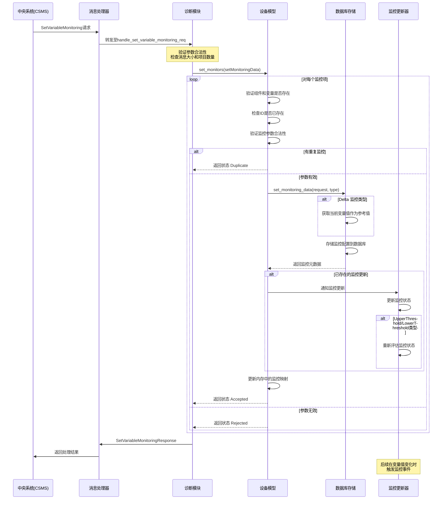

# SetVariableMonitoring 处理流程

当桩端接收到 SetVariableMonitoring 报文后，会执行以下操作：

根据代码分析，当充电桩接收到 SetVariableMonitoring 报文后，主要执行以下操作：

## 消息接收和参数验证

- 首先，消息被 `MessageDispatcher` 转发到 `Diagnostics` 模块的 `handle_set_variable_monitoring_req` 方法处理
- 系统会验证报文的大小和监控项数量是否符合配置限制（N04.FR.09规范要求）
- 如果不符合，返回相应的错误

## 设置监控配置

- 调用 `DeviceModel::set_monitors` 方法，对每个监控项（`SetMonitoringData`）进行处理
- 验证每个监控项:
  - 检查指定的组件和变量是否存在
  - 如果提供了监控ID，验证该ID是否已存在
  - 检查是否有重复的监控配置，如有则返回 `Duplicate` 状态

## 数据库存储

- 调用 `DeviceModelStorageSqlite::set_monitoring_data` 将监控配置存储到数据库
- 对于 Delta 类型的监控，系统会获取变量当前值作为参考值
- 根据监控配置，将相关参数（severity、transaction、type、value等）存入数据库

## 内存更新

- 如果数据库存储成功，会更新设备模型中的内存映射，添加或替换监控配置
- 对于已存在的监控更新，会触发监控更新监听器（`monitor_update_listener`）

## 监控更新器处理

- 如果是监控更新，`MonitoringUpdater` 会更新监控状态
- 对于 UpperThreshold/LowerThreshold 类型的监控，会重新评估当前状态

## 响应处理

- 生成 `SetVariableMonitoringResponse` 响应，包含每个监控项的处理结果
- 通过 `MessageDispatcher` 将响应发送回 CSMS

## 后续监控

- 后续当变量值发生变化时，`MonitoringUpdater` 会评估监控条件是否触发
- 根据监控类型（Delta、UpperThreshold、LowerThreshold等）和数据类型计算是否触发
- 触发的监控会被添加到监控更新器的内部列表，等待处理和通知

# 代码关键实现

1. 监控设置的主要实现在 `Diagnostics::handle_set_variable_monitoring_req` 方法中（`diagnostics.cpp` 第275行左右）

2. 设备模型处理监控的核心逻辑在 `DeviceModel::set_monitors` 方法中（`device_model.cpp` 第625-823行）

3. 数据库存储在 `DeviceModelStorageSqlite::set_monitoring_data` 方法中（`device_model_storage_sqlite.cpp` 第271-316行）

4. 监控评估的逻辑在 `MonitoringUpdater::evaluate_monitor` 方法中（`monitoring_updater.cpp` 第210-235行）

这些操作确保了充电桩能够根据 CSMS 的要求设置和更新变量监控，并在后续变量变化时正确触发相应的监控事件。

# VariableMonitoringType

`VariableMonitoringType` 结构体定义了对变量的监控设置。其成员包括以下字段：

- **`id`**: `integer`。**必需 (Required)**。用于**标识监控器**。
- **`transaction`**: `boolean`。**必需 (Required)**。指示该监控器是否仅在与此监控器相关的组件上进行中的**交易期间处于活动状态**。默认值为 `false`。
- **`value`**: `decimal`。**必需 (Required)**。用于**阈值或增量监控的值**。对于 `Periodic` 或 `PeriodicClockAligned` 类型的监控器，此字段表示**间隔的秒数**。
- **`type`**: `MonitorEnumType`。**必需 (Required)**。此监控器的**类型**，例如阈值、增量或周期性监控器。`MonitorEnumType` 的可能值包括 `UpperThreshold`（高于设定值时触发事件）、`LowerThreshold`（低于设定值时触发事件）、`Delta`（实际值变化超过设定值时触发事件）、`Periodic`（每隔设定时间间隔触发事件）和 `PeriodicClockAligned`（从最近的时钟对齐间隔开始，每隔设定时间间隔触发事件）。
- **`severity`**: `integer`。**必需 (Required)**。由此监控器触发的事件将被分配的**严重性**。严重性范围是 0-9，0 为最高级别，9 为最低级别。

因此，`VariableMonitoringType` 结构体包含了**监控器的唯一标识符**、**是否仅在交易期间激活**、**监控触发的值或间隔**、**监控的类型**以及**触发事件的严重程度**等信息。这些信息共同定义了一个对特定变量的监控规则。
