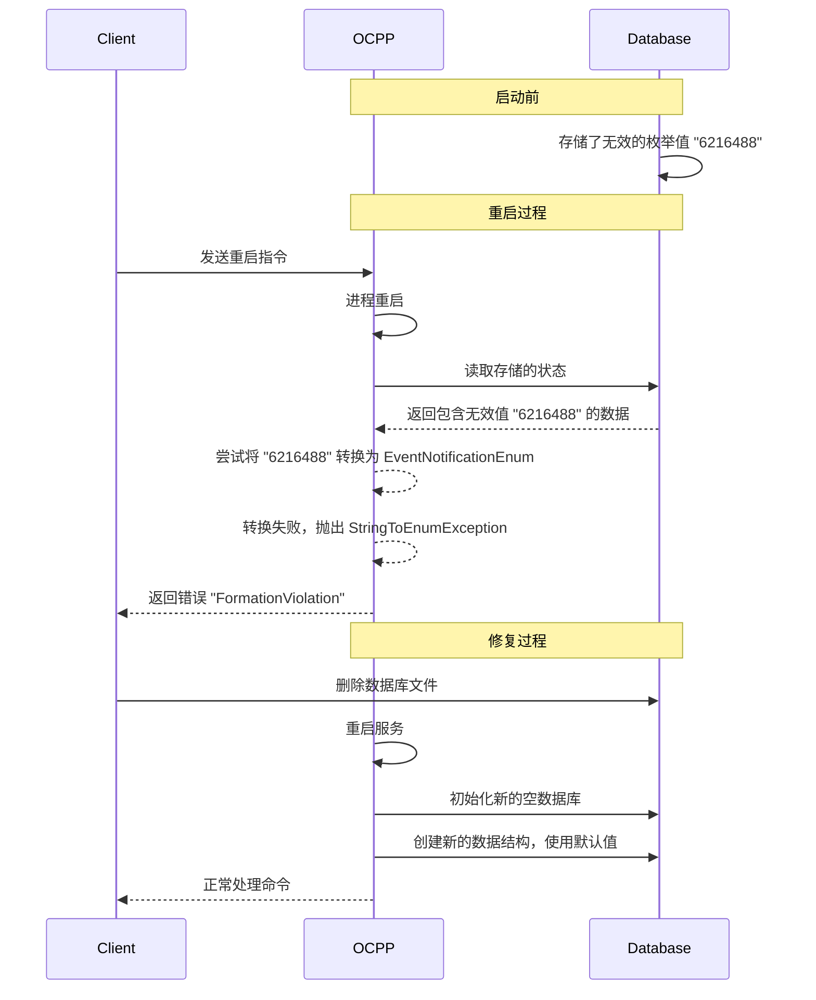

# 问题

执行 octt 测试用例 N56 后，会导致 ocpp 进程重启，随后所有的 ocpp 指令下发后都会类型转换错误。向平台输出错误日志

```shell
2025-04-07T06:44:17.737Z: ChargePoint>CentralSystem Unknown  
[  
4,  
"3eb7e6c4-ea0e-4ed2-8c4f-a90f38f903d7",  
"FormationViolation",  
"No known conversion from value '6216488' to EventNotificationEnum",  
{}  
]
```

# 解决方法

```shell
rm /share/everest/modules/OCPP201/device_model_storage.db
```

# 为什么删除数据库解决了问题

问题根源是数据库中存储了无效的 EventNotificationEnum 枚举值 "6216488"，而这个值在 OCPP 协议中不存在。

## 问题分析

查看代码，我们可以发现 EventNotificationEnum 只有 4 个合法值：

```cpp
enum class EventNotificationEnum {
    HardWiredNotification,
    HardWiredMonitor,
    PreconfiguredMonitor,
    CustomMonitor,
};
```

当 OCPP 重启时，它会从数据库读取之前存储的状态，然后尝试将字符串或数字转换为相应的枚举值：

```cpp
EventNotificationEnum string_to_event_notification_enum(const std::string& s) {
    if (s == "HardWiredNotification") {
        return EventNotificationEnum::HardWiredNotification;
    }
    if (s == "HardWiredMonitor") {
        return EventNotificationEnum::HardWiredMonitor;
    }
    if (s == "PreconfiguredMonitor") {
        return EventNotificationEnum::PreconfiguredMonitor;
    }
    if (s == "CustomMonitor") {
        return EventNotificationEnum::CustomMonitor;
    }

    throw StringToEnumException{s, "EventNotificationEnum"};
}
```

当数据库中的值为 "6216488" 时，转换会失败并抛出异常，导致所有 OCPP 命令失败。

## 流程图解



## 为什么会出现这个问题

可能的原因：

**数据损坏**：数据库可能在某个时刻被意外修改

## 为什么删除解决了问题

删除数据库后，OCPP 服务重新初始化了一个全新的数据库，使用了正确的枚举值。系统状态被重置为干净状态，没有无效数据。

从 `charge_point.cpp` 的初始化过程我们可以看到，当系统启动时，它会检查数据库完整性并初始化所有组件：

```cpp
ChargePoint::ChargePoint(...) {
    // ...
    initialize(evse_connector_structure, message_log_path);
}

void ChargePoint::initialize(...) {
    this->device_model->check_integrity(evse_connector_structure);
    this->database_handler->open_connection();
    // ...
}
```

当数据库不存在时，系统会创建一个新的并使用默认值，避免了无效枚举问题。
