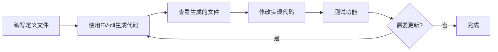

EV-cli本质上是一个帮助我们**自动生成和管理EVerest项目代码**的工具，就像是一个"代码生成助手"。它主要做这些事：

1. 帮我们创建新的模块
2. 生成各种接口文件
3. 更新已有的代码
4. 提供一些便利工具

# 工作流程

```mermaid
flowchart LR
    A[编写定义文件] --> B[使用EV-cli生成代码]
    B --> C[查看生成的文件]
    C --> D[修改实现代码]
    D --> E[测试功能]
    E --> F{需要更新?}
    F -->|是| B
    F -->|否| G[完成]
```
