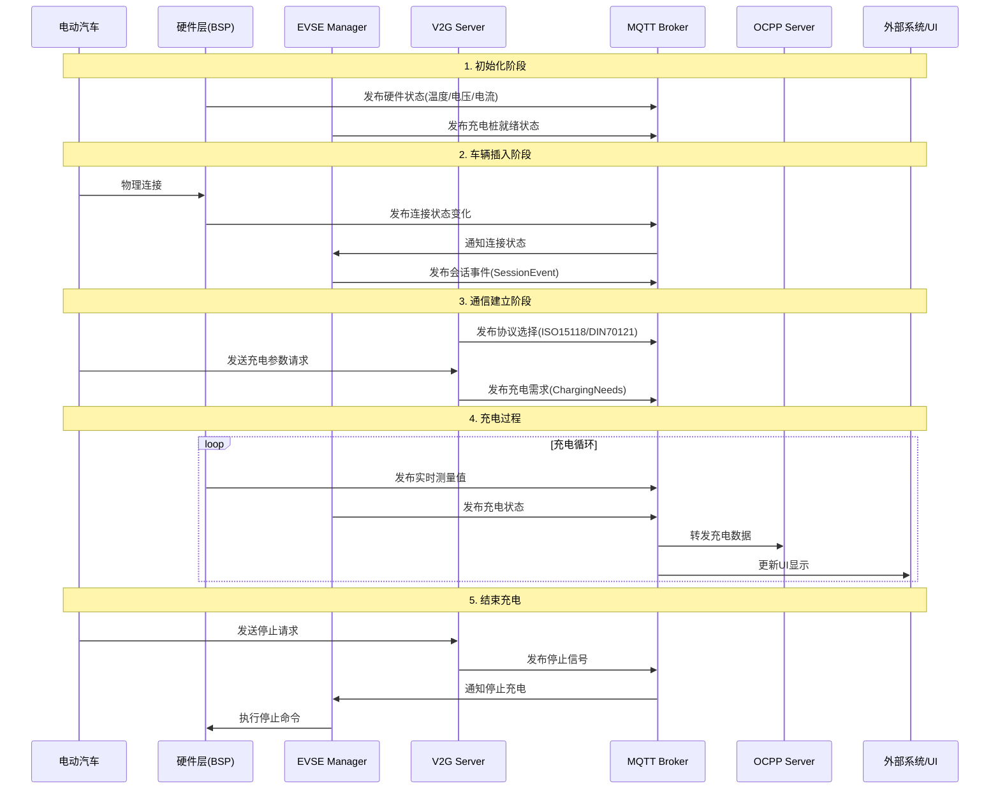

# 流程图

从充电过程的顺序分析 MQTT 通信架构



# 初始化阶段

## 硬件层初始化

```c
// modules/MicroMegaWattBSP/MicroMegaWattBSP.cpp
void MicroMegaWattBSP::ready() {
    serial.signalTelemetry.connect([this](Telemetry t) {
        mqtt.publish("everest_external/umwc/cp_hi", t.cp_hi);
        mqtt.publish("everest_external/umwc/cp_lo", t.cp_lo);
        mqtt.publish("everest_external/umwc/pwm_dc", t.pwm_dc);
        mqtt.publish("everest_external/umwc/relais_on", t.relais_on);
        mqtt.publish("everest_external/umwc/output_voltage", t.voltage);
    });
}
```

这里硬件模块会定期发布基础状态数据到 MQTT。

## EVSE Manager 初始化

```c
// evse_managerImpl.cpp
void evse_managerImpl::ready() {
    // 发布充电桩ID
    publish_evse_id(mod->config.evse_id);

    // 订阅遥测数据
    mod->r_bsp->subscribe_telemetry([this](types::evse_board_support::Telemetry telemetry) {
        mod->mqtt.publish(fmt::format("everest_external/nodered/{}/state/temperature", 
            mod->config.connector_id), telemetry.evse_temperature_C);
    });
}
```

# 车辆插入阶段

当车辆物理连接后，BSP 会检测到并通过 MQTT 通知系统：

```c
// Setup.cpp
void Setup::ready() {
    this->publish_application_info_thread = std::thread([this]() {
        while (true) {
            this->publish_supported_features();
            this->publish_application_info();
            this->publish_ap_state();
            std::this_thread::sleep_for(std::chrono::seconds(1));
        }
    });
}
```

# 通信建立阶段

V2G 服务器负责处理与车辆的==高级通信协议==：

```c
// v2g_server.cpp
switch (selected_protocol) {
    case V2G_PROTO_ISO15118_2013:
        // 处理 ISO15118 通信
        v2gEvent = iso_handle_request(conn);
        break;
    case V2G_PROTO_DIN70121:
        // 处理 DIN70121 通信
        v2gEvent = din_handle_request(conn);
        break;
}
```

充电参数协商：

```c
// iso_server.cpp
static void publish_iso_charge_parameter_discovery_req(
    struct v2g_context* ctx,
    struct iso2_ChargeParameterDiscoveryReqType const* const v2g_charge_parameter_discovery_req) {
    
    types::iso15118::ChargingNeeds charging_needs;
    charging_needs.requested_energy_transfer = transfer_mode;
    ctx->p_extensions->publish_charging_needs(charging_needs);
}
```

# 充电过程

在充电过程中，系统会持续发布状态更新：

```c
// API.cpp
this->api_threads.push_back(std::thread([this, var_session_info]() {
    while (this->running) {
        this->mqtt.publish(var_session_info, *session_info);
        this->mqtt.publish(var_hw_caps, hw_caps);
        next_tick += NOTIFICATION_PERIOD;
        std::this_thread::sleep_until(next_tick);
    }
}));
```

同时支持外部控制和监控：

```c
// OCPP201.cpp
if (this->config.EnableExternalWebsocketControl) {
    this->mqtt.subscribe("everest_api/ocpp/cmd/connect",
        [this](const std::string& data) { 
            this->charge_point->connect_websocket(); 
        });
}
```

# 错误处理

系统还包含完整的错误处理机制：

```c
// YetiSimulator.cpp
mqtt.subscribe("everest_external/nodered/" + std::to_string(config.connector_id) + "/carsim/error",
    [this](const std::string& payload) {
        const auto [raise, error_definition] = parse_error_type(payload);
        if (error_definition->error_target == ErrorTarget::BoardSupport) {
            const auto error = p_board_support->error_factory->create_error(
                error_definition->type, 
                error_definition->sub_type, 
                error_definition->message,
                error_definition->severity
            );
            forward_error(p_board_support, error, raise);
        }
    });
```

# MQTT 主题结构

主要的 MQTT 主题结构如下：

## 硬件状态主题

- everest_external/umwc/* - 硬件基础数据

- everest_external/nodered/{connector_id}/state/* - 连接器状态

## 控制命令主题

- everest_api/ocpp/cmd/* - OCPP 控制命令

- everest_external/nodered/{connector_id}/carsim/cmd/* - 模拟器控制

## 错误和诊断主题

- everest_external/nodered/{connector_id}/carsim/error - 错误报告

- everest_external/nodered/{connector_id}/state/temperature - 温度监控

这种分层的通信架构确保了

1. 模块解耦：各个组件通过 MQTT 消息进行通信，不直接依赖

2. 实时性：关键状态变化可以立即通知到相关组件

3. 可扩展性：新功能可以通过订阅相关主题来实现

4. 可靠性：包含错误处理和状态监控机制

5. 标准兼容：支持多种充电协议和标准

通过这种基于 MQTT 的架构，整个充电系统可以灵活地协调各个组件的工作，并支持实时监控和控制。
