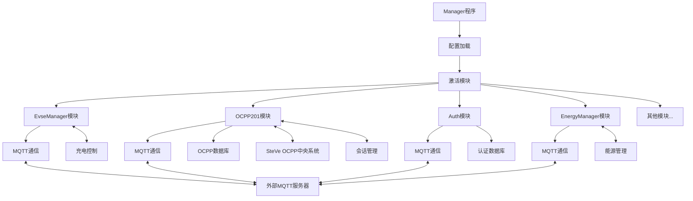

# Everest管理器架构分析

Everest的manager程序是一个**模块化的充电桩控制系统**，它的核心特点是：

## 模块化架构

从配置文件`config-sil-ocpp201.yaml`中可以看到，系统由多个独立模块组成：

- **EvseManager**: 负责充电桩基本控制，管理单个充电连接器
- **OCPP201**: 实现OCPP 2.0.1协议通信
- **Auth**: 处理认证逻辑
- **EnergyManager**: 管理能源分配
- **EnergyNode**: 能源节点，用于限制和监控能源消耗
- **YetiSimulator**: 模拟硬件

每个模块有明确的职责，并通过定义的接口相互通信。

## 基于MQTT的通信架构

[mqtt](./mqtt%E9%80%9A%E4%BF%A1%E6%9E%B6%E6%9E%84.md)是系统内外部通信的核心机制：

```cpp
// 从EvManager.hpp
class EvManager : public Everest::ModuleBase {
    Everest::MqttProvider& mqtt;
    // ...
}

// 从MicroMegaWattBSP.cpp，可以看到MQTT的使用
serial.signalTelemetry.connect([this](Telemetry t) {
    mqtt.publish("everest_external/umwc/cp_hi", t.cp_hi);
    mqtt.publish("everest_external/umwc/cp_lo", t.cp_lo);
    mqtt.publish("everest_external/umwc/pwm_dc", t.pwm_dc);
    mqtt.publish("everest_external/umwc/relais_on", t.relais_on);
    mqtt.publish("everest_external/umwc/output_voltage", t.voltage);
});
```

所有模块通过MQTT发布/订阅机制交换信息，这使得模块之间可以松耦合，而且可以与外部系统进行通信。MQTT话题采用层次结构，例如`everest_external/umwc/cp_hi`。

## 外部服务依赖

从docker-compose文件中可以看到系统依赖的外部服务：

- **MQTT服务器（mqtt-server）**: 所有模块通过MQTT服务器通信
- **OCPP数据库（ocpp-db）**: 存储OCPP相关数据
- **SteVe服务器**: 作为OCPP中央系统

在OCPP201模块中，可以看到对数据库的使用：

```cpp
this->charge_point = std::make_unique<ocpp::v16::ChargePoint>(
    json_config.dump(), this->ocpp_share_path, user_config_path, 
    std::filesystem::path(this->config.DatabasePath),
    sql_init_path, std::filesystem::path(this->config.MessageLogPath),
    std::make_shared<EvseSecurity>(*this->r_security));
```

## 模块间通信机制

模块间通信主要通过两种方式：

1. **直接调用接口**: 模块可以通过定义的接口直接调用其他模块的方法

```cpp
// 直接调用接口示例
this->r_evse_manager.at(this->connector_evse_index_map.at(connector))->call_pause_charging();
```

2. **通过MQTT的发布/订阅机制**: 模块可以发布事件或状态变化，其他模块订阅这些事件

```cpp
// MQTT订阅示例
this->mqtt.subscribe(cmd_enable, [this, &evse](const std::string& data) {
    // 处理enable命令
});
```

## Manager程序的核心作用

`manager`程序是整个系统的入口点，它负责：

1. 加载配置文件（例如`config-sil-ocpp201.yaml`）
2. 初始化并激活所需的模块
3. 建立模块间的连接关系
4. 维护模块的生命周期

从`run-sil-ocpp201.sh`脚本可以看到它的调用方式：

```bash
LD_LIBRARY_PATH=/workspace/everest-core/build/dist/lib:$LD_LIBRARY_PATH \
PATH=/workspace/everest-core/build/dist/bin:$PATH \
manager \
    --prefix /workspace/everest-core/build/dist \
    --conf /workspace/everest-core/config/config-sil-ocpp201.yaml \
<br/>
    $@
```

## 具体工作流程

当`run-sil-ocpp201.sh`脚本执行时：

1. **启动manager程序**：加载配置文件`config-sil-ocpp201.yaml`
2. **初始化模块**：根据配置创建并初始化各个模块
3. **建立连接**：根据配置文件中的`connections`部分建立模块间的连接关系
4. **与外部服务通信**：
   - 通过MQTT与外部MQTT服务器通信
   - OCPP201模块与SteVe服务器建立WebSocket连接
   - 模块需要访问数据库时连接到外部数据库服务

因此，当你直接在WSL环境中运行脚本时，仍然需要先启动Docker Compose服务，因为`manager`程序需要连接到这些外部服务（MQTT、数据库和SteVe服务器）才能正常工作。即使不在容器中运行，这些依赖关系仍然存在。
