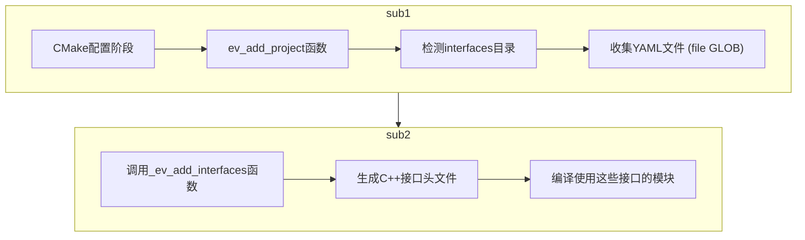

# 接口YAML文件识别

CMake首先在 cmake/everest-generate.cmake 文件中的 `ev_add_project` 函数中检查项目是否包含interfaces目录：

```c
# check for interfaces
set (INTERFACES_DIR "${EVEREST_PROJECT_DIR}/interfaces")
if (EXISTS ${INTERFACES_DIR})
    message(STATUS "Adding interface definitions from ${INTERFACES_DIR}")
    file(GLOB INTERFACE_FILES
        ${INTERFACES_DIR}/*.yaml
    )

    _ev_add_interfaces(${INTERFACE_FILES})

    if (CALLED_FROM_WITHIN_PROJECT)
        install(
            DIRECTORY ${INTERFACES_DIR}
            DESTINATION "${CMAKE_INSTALL_DATADIR}/everest"
            FILES_MATCHING PATTERN "*.yaml"
        )
    endif ()
endif ()
```

# 接口代码生成

系统调用 `_ev_add_interfaces` 函数处理这些YAML文件

```yaml
   add_custom_command(
       # ...
       COMMAND
           ${EV_CLI} interface generate-headers
               --disable-clang-format
               --schemas-dir "$<TARGET_PROPERTY:generate_cpp_files,EVEREST_SCHEMA_DIR>"
               --output-dir "$<TARGET_PROPERTY:generate_cpp_files,EVEREST_GENERATED_INCLUDE_DIR>/generated/interfaces"
               --everest-dir ${EVEREST_PROJECT_DIRS}
       # ...
   )
```

这个命令使用EV_CLI工具将YAML接口定义转换为C++头文件。

# 生成的文件位置

生成的接口头文件位于构建目录的generated/include/generated/interfaces目录中。

# 整体工作流程

## 在构建时

CMake收集所有接口YAML文件
使用EV_CLI工具将YAML转换为C++头文件
生成对应的接口实现基类

## 在模块开发中

模块开发者继承和实现这些自动生成的接口基类
利用生成的接口代码实现模块间通信

## 在运行时

模块通过这些接口连接和通信
框架根据配置文件连接提供和请求相同接口的模块
