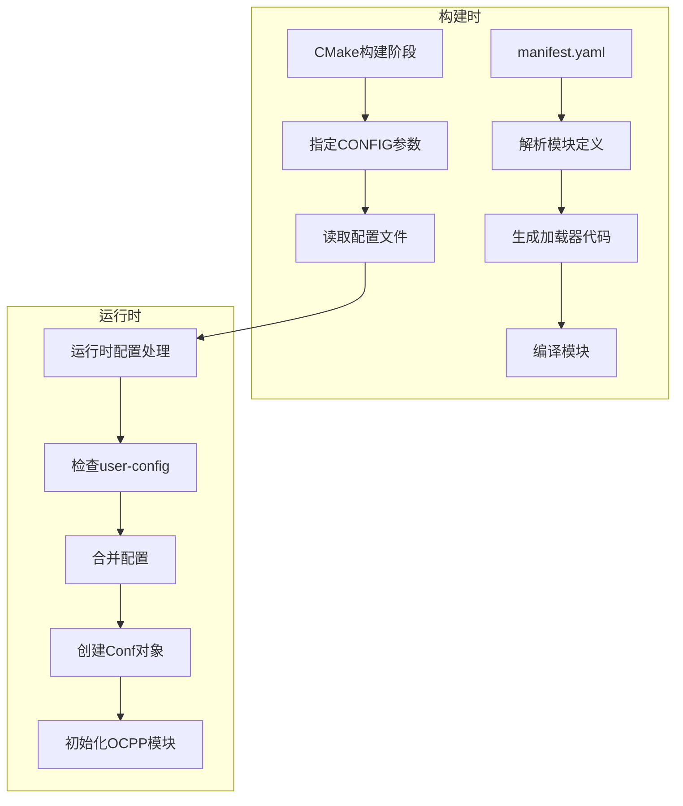

# OCPP模块配置处理流程图



# 构建时配置文件选择

CMake通过 cmake/config-run-script.cmake 中的 generate_config_run_script 函数指定使用的配置文件：

```cmake
function(generate_config_run_script)
    # ...
    if (NOT OPTNS_CONFIG)
        message(FATAL_ERROR "${CMAKE_CURRENT_FUNCTION} requires CONFIG parameter for the config name")
    endif()

    set(CONFIG_FILE "${CMAKE_CURRENT_SOURCE_DIR}/config-${OPTNS_CONFIG}.yaml")
    # ...
    set(SCRIPT_OUTPUT_FILE "${SCRIPT_OUTPUT_PATH}/run-${OPTNS_CONFIG}.sh")
    # ...
```

1. 首先接收一个CONFIG参数
2. 然后构建配置文件路径：`set(CONFIG_FILE "${CMAKE_CURRENT_SOURCE_DIR}/config-${OPTNS_CONFIG}.yaml")`
3. 这表明EVerest使用命名约定来选择配置文件。配置文件名称格式为config-{配置名}.yaml

系统遵循命名约定，使用config-{配置名}.yaml格式的配置文件，例如：

```sh
config-hil.yaml
config-sil.yaml
config-sil-ocpp.yaml
```

在构建过程中，CMake会为每个配置[生成一个对应的运行脚本](./%E8%BF%90%E8%A1%8C%E8%84%9A%E6%9C%AC%E7%94%9F%E6%88%90%E8%BF%87%E7%A8%8B.md)（如run-sil.sh或run-hil.sh）。运行时，用户通过执行特定的脚本来选择使用哪个配置文件：

```c
# 运行使用sil配置的EVerest
./run-sil.sh

# 运行使用hil配置的EVerest
./run-hil.sh
```

这里的sil是Software-in-the-Loop的意思。

# 配置文件覆盖机制

系统会检查user-config目录中是否存在同名配置文件。如果存在，将合并这两个配置：

```sh
user-config/config-sil-ocpp.yaml 中的设置会覆盖 config-sil-ocpp.yaml 中的同名设置
```

这使得在不修改主配置文件的情况下自定义配置。

# manifest.yaml处理阶段

EVerest框架首先处理每个模块的 manifest.yaml 文件，这是在CMake构建阶段完成的。

```c
add_custom_command(
    OUTPUT
        ${MODULE_LOADER_DIR}/ld-ev.hpp
        ${MODULE_LOADER_DIR}/ld-ev.cpp
    COMMAND
        ${EV_CLI} module generate-loader
            --disable-clang-format
            --schemas-dir "$<TARGET_PROPERTY:generate_cpp_files,EVEREST_SCHEMA_DIR>"
            --output-dir ${GENERATED_MODULE_DIR}
            ${RELATIVE_MODULE_DIR}
    DEPENDS
        ${MODULE_PATH}/manifest.yaml
    WORKING_DIRECTORY
        ${PROJECT_SOURCE_DIR}
    COMMENT
        "Generating ld-ev for module ${MODULE_NAME}"
)
```

上面的代码在 everest-generate.cmake 文件中，他是核心生成脚本。这个命令会根据
manifest.yaml 文件生成两个关键文件：

- ld-ev.hpp - 加载器头文件
- ld-ev.cpp - 加载器实现文件

在模块的manifest.yaml可以看到其支持的配置项：

```yaml
config:
  ChargePointConfigPath:
    description: Path to the configuration file
    type: string
    default: ocpp-config.json
  MessageLogPath:
    description: Path to folder where logs of all OCPP messages get written to
    type: string
    default: /tmp/everest_ocpp_logs
  # 其他配置项...
```

这些配置项会在构建时被解析，并在生成的加载器代码中使用。

# 生成的加载器代码结构

生成的 ld-ev.cpp 包含**读取配置并创建Conf对象**的代码。加载器会：

1. 解析模块在配置文件中的 `config_module` 和 `config_implementation` 部分
2. 创建相应的配置结构体对象
3. 将配置值填充到这些结构体中

# OCPP模块配置文件示例

从 config-sil-ocpp.yaml 中可以看到OCPP模块的配置

```yaml
ocpp:
  module: OCPP
  config_module:
    ChargePointConfigPath: config-docker.json
  connections:
    evse_manager:
      - module_id: evse_manager_1
        implementation_id: evse
    security:
      - module_id: evse_security
        implementation_id: main
```

# Conf对象创建过程

以 ocpp_1_6_charge_pointImpl.hpp 为例，这里定义了一个Conf结构体：

```cpp
struct Conf {};

class ocpp_1_6_charge_pointImpl : public ocpp_1_6_charge_pointImplBase {
public:
    ocpp_1_6_charge_pointImpl(Everest::ModuleAdapter* ev, const Everest::PtrContainer<OCPP>& mod, Conf& config) :
        ocpp_1_6_charge_pointImplBase(ev, "main"), mod(mod), config(config){};
```

创建Conf对象的具体步骤：

1. 加载器在运行时读取配置文件（如config-sil-ocpp.yaml）
2. 解析config_module和每个接口实现的config_implementation部分
3. 创建相应的Conf结构体实例
4. 使用YAML解析库将配置值转换为C++类型并填充到Conf对象中
5. 在模块初始化时，将这个Conf对象传递给相应的实现类构造函数

# 配置处理的代码生成

EVerest通过自动生成的代码处理配置，基本流程是：

```c
// 在ld-ev.cpp中生成的代码示例（简化版）
void loadModule(framework::ModuleLoader& loader) {
    // 读取配置
    auto module_config = loader.getConfig();
    
    // 创建模块级配置对象
    ModuleConfig config;
    if (module_config.contains("config_module")) {
        auto& cfg = module_config["config_module"];
        // 填充配置
        if (cfg.contains("ChargePointConfigPath"))
            config.ChargePointConfigPath = cfg["ChargePointConfigPath"].get<std::string>();
    }
    
    // 创建实现级配置对象
    main::Conf main_config;
    if (module_config.contains("config_implementation") && 
        module_config["config_implementation"].contains("main")) {
        auto& impl_cfg = module_config["config_implementation"]["main"];
        // 填充实现级配置
    }
    
    // 创建模块实例
    auto module = std::make_shared<OCPP>(loader.getModuleInfo(), config);
    
    // 注册实现
    module->registerImpl<main::ocpp_1_6_charge_pointImpl>("main", main_config);
}
```

# 运行时模块实例化

当EVerest框架启动时：

1. 加载配置文件（如config-sil-ocpp.yaml）
2. 为每个配置的模块调用相应的加载器函数
3. 加载器创建模块实例和所有配置的实现
4. 连接模块间的接口依赖关系
