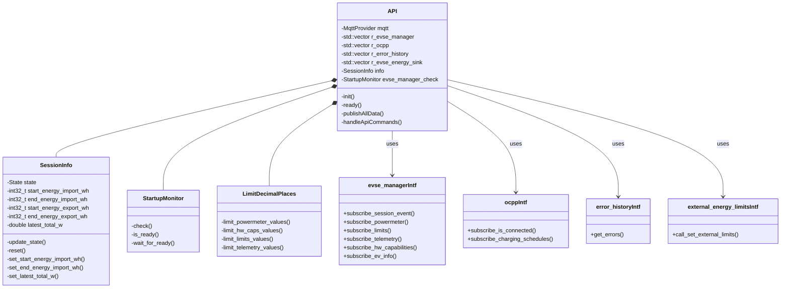
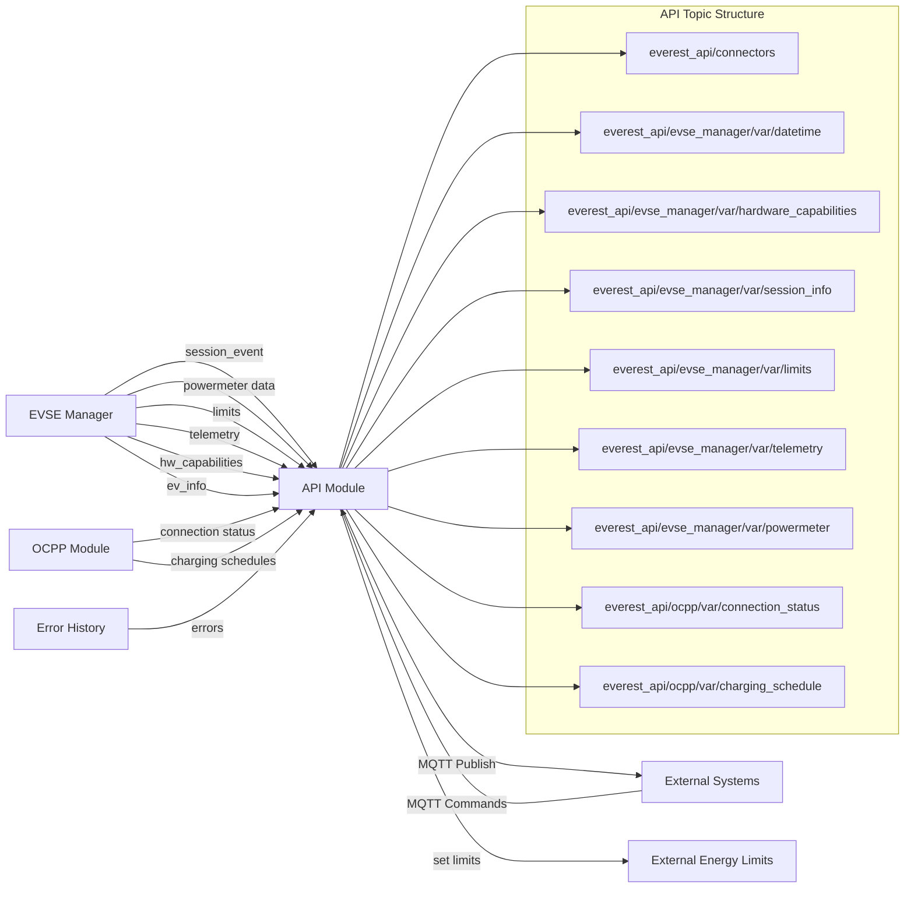
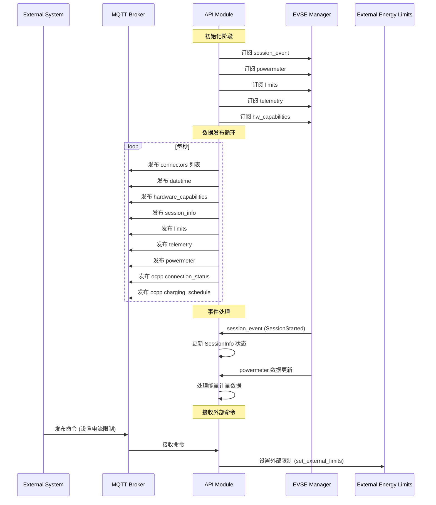
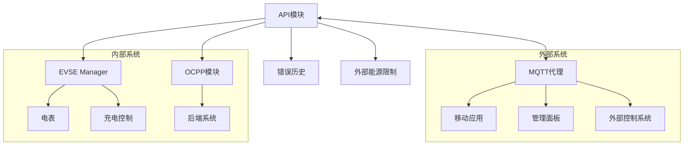

# API模块分析

API模块是Everest Core项目中的关键组件，主要负责==将内部系统状态和功能通过MQTT协议暴露给外部系统==。

## API模块结构图



## API数据流图



## API功能调用序列图



# API模块核心功能分析

## 系统状态监控和发布

```cpp
void API::init() {
    // 创建十进制位数限制处理器
    this->limit_decimal_places = std::make_unique<LimitDecimalPlaces>(this->config);
    
    // 初始化充电器信息
    if (!this->config.charger_information_file.empty()) {
        try {
            this->charger_information = Everest::yaml_loader::load(this->config.charger_information_file);
        } catch (const std::exception& e) {
            EVLOG_warning << "Could not load charger_information_file: " << e.what();
        }
    }

    // 为每个EVSE管理器创建会话信息对象
    for (auto& evse : this->r_evse_manager) {
        this->info.push_back(std::make_unique<SessionInfo>());
    }

    // 初始化MQTT订阅和发布机制
    this->api_threads.emplace_back([this]() {
        // 创建定期发布数据的线程
        while (this->running) {
            std::this_thread::sleep_for(NOTIFICATION_PERIOD);
            this->publishAllData();
        }
    });

    // 处理API命令的线程
    this->api_threads.emplace_back([this]() {
        // 订阅命令主题并处理接收到的命令
        this->handleApiCommands();
    });
}
```

## 会话状态管理

SessionInfo类负责管理和跟踪每个充电会话的状态：

```cpp
void SessionInfo::update_state(const types::evse_manager::SessionEventEnum event) {
    std::lock_guard<std::mutex> lock(this->session_info_mutex);
    using Event = types::evse_manager::SessionEventEnum;

    // 根据不同的事件更新会话状态
    switch (event) {
    case Event::Enabled:
        this->state = State::Unplugged;
        break;
    case Event::Disabled:
        this->state = State::Disabled;
        break;
    case Event::AuthRequired:
        this->state = State::AuthRequired;
        break;
    // ... 其他状态处理
    }
}
```

## 数据格式化和限制处理

LimitDecimalPlaces类负责处理数值的四舍五入和小数位限制：

```cpp
// 对电表数据应用小数位限制
void LimitDecimalPlaces::limit_powermeter_values(types::powermeter::Powermeter& powermeter) {
    // 限制能量值的小数位
    if (powermeter.energy_Wh_import.has_value()) {
        for (auto& [key, value] : powermeter.energy_Wh_import.value()) {
            value = round_to_decimal_places(value, config.powermeter_energy_import_decimal_places);
            if (config.powermeter_energy_import_round_to > 0) {
                value = round_to_nearest(value, config.powermeter_energy_import_round_to);
            }
        }
    }
    
    // 限制功率值的小数位
    if (powermeter.power_W.has_value()) {
        for (auto& [key, value] : powermeter.power_W.value()) {
            value = round_to_decimal_places(value, config.powermeter_power_decimal_places);
            if (config.powermeter_power_round_to > 0) {
                value = round_to_nearest(value, config.powermeter_power_round_to);
            }
        }
    }
    
    // ... 其他电表数据处理
}
```

## 外部命令处理

API模块处理从MQTT接收的命令并将其转换为内部操作：

```cpp
void API::handleApiCommands() {
    // 订阅命令主题
    this->mqtt.subscribe(api_base + "cmd/#", [this](const std::string& topic, const std::string& data) {
        // 解析命令主题
        std::vector<std::string> topic_parts;
        // ... 分割主题字符串

        // 处理不同类型的命令
        if (topic_parts.size() >= 4 && topic_parts[2] == "cmd") {
            const auto& cmd = topic_parts[3];
            
            // 处理设置电流限制的命令
            if (cmd == "set_current_limit" && topic_parts.size() == 5) {
                try {
                    const auto& evse_id = topic_parts[1];
                    const auto& limit_str = topic_parts[4];
                    float limit = std::stof(data);
                    
                    // 设置电流限制
                    auto external_limits = get_external_limits(limit_str, false);
                    // ... 应用限制到对应的EVSE
                } catch (const std::exception& e) {
                    EVLOG_error << "Failed to process set_current_limit command: " << e.what();
                }
            }
            
            // ... 处理其他类型的命令
        }
    });
}
```

# API模块与其他模块的关系



# API模块的主要MQTT主题结构

下面是API模块发布的主要MQTT主题：

```
everest_api/
├── connectors                        # 可用连接器列表
├── evse_manager/
│   ├── var/
│   │   ├── datetime                  # 当前UTC时间(RFC3339格式)
│   │   ├── hardware_capabilities     # 硬件能力(电流限制、相位数等)
│   │   ├── session_info              # 当前充电会话信息
│   │   ├── limits                    # 当前EVSE限制
│   │   ├── telemetry                 # EVSE遥测数据
│   │   └── powermeter                # 电表数据
│   └── cmd/                          # 命令主题
│       ├── set_current_limit         # 设置电流限制
│       ├── set_phases                # 设置相数
│       └── ...                       # 其他命令
└── ocpp/
    └── var/
        ├── connection_status         # OCPP连接状态
        └── charging_schedule         # OCPP充电计划
```

# 总结

API模块在Everest Core系统中扮演着关键的桥梁角色，它通过MQTT协议将内部系统状态和功能暴露给外部系统，并接收和处理来自外部的命令。主要特点包括：

1. **数据发布**：定期发布系统状态、充电会话信息、电表数据等到预定义的MQTT主题
2. **命令处理**：接收并处理来自外部系统的命令，如设置电流限制、调整相数等
3. **数据格式化**：对数值进行四舍五入和小数位限制，确保数据一致性和可读性
4. **会话管理**：跟踪和管理充电会话的状态，提供充电会话的完整信息

通过API模块，外部系统（如移动应用、管理面板、控制系统等）可以监控充电站状态、控制充电行为，实现与Everest Core系统的无缝集成，使充电设施能够被远程监控和管理。
