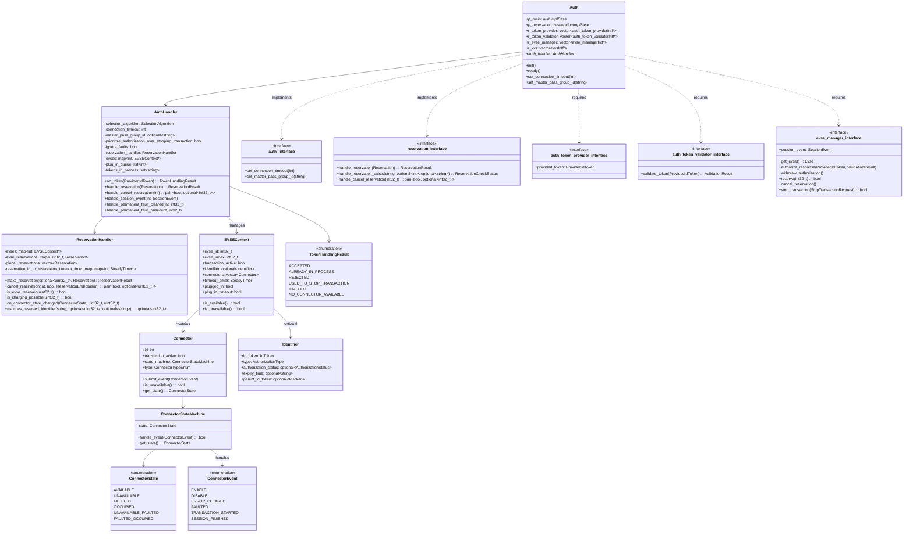
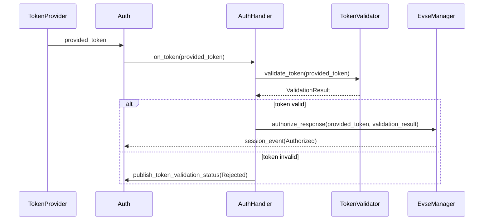
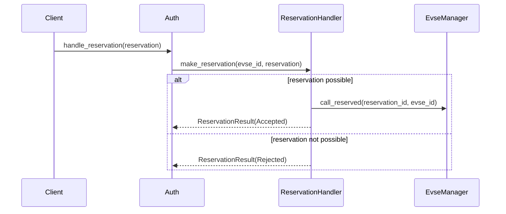
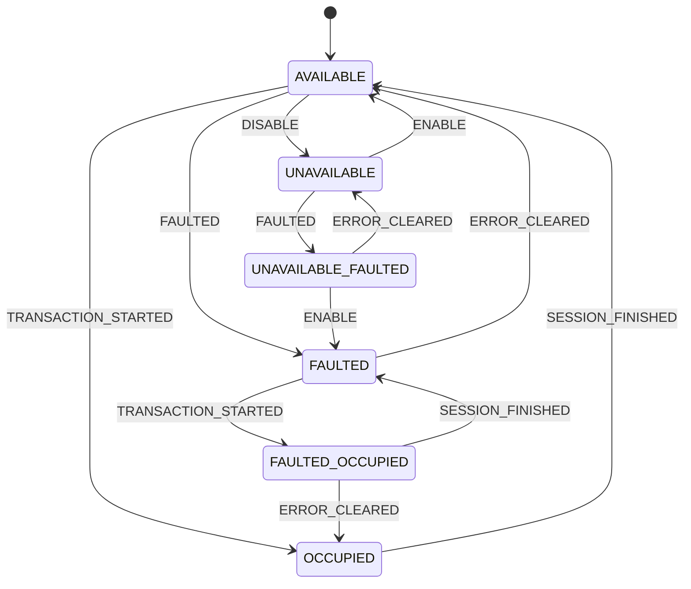

# Auth模块架构图



# Auth模块架构分析

Auth模块是Everest Core项目中负责认证处理和预约管理的核心模块。它管理**电动汽车充电过程中的认证、授权和预约功能**。

## 核心组件结构

### Auth类

- 作为模块入口点，实现了authImplBase和reservationImplBase接口
- 包含AuthHandler实例，负责处理具体的认证逻辑
- 在初始化时建立与其他模块的连接（token_provider、token_validator、evse_manager）

### AuthHandler类

- 负责处理认证、授权和处理会话事件
- 管理EVSEContext对象集合，表示充电桩的状态
- 包含ReservationHandler处理预约相关功能

### Connector和ConnectorStateMachine

- Connector: 表示物理连接器，包含状态机
- ConnectorStateMachine: 实现连接器的状态转换逻辑

### ReservationHandler

- 处理预约的创建、取消和状态管理
- 支持特定EVSE的预约和全局预约

## 主要对象和状态

### EVSE与Connector状态

- EVSE（充电桩）包含多个Connector（连接器）
- ConnectorState表示连接器的状态：
  - AVAILABLE: 可用
  - UNAVAILABLE: 不可用
  - FAULTED: 故障
  - OCCUPIED: 被占用
  - UNAVAILABLE_FAULTED: 不可用且故障
  - FAULTED_OCCUPIED: 故障且被占用

### 认证对象

- ProvidedIdToken: 由auth_token_provider提供的标识令牌
- ValidationResult: 验证结果
- Identifier: 验证后的标识信息

### 预约对象

- Reservation: 表示一个预约请求
- ReservationResult: 预约请求结果

## 工作流程

### 认证流程



### 预约处理流程



### 状态管理



## 关键代码分析

### 令牌处理

```cpp
TokenHandlingResult AuthHandler::on_token(const ProvidedIdToken& provided_token) {
    // 加锁以确保线程安全
    std::unique_lock<std::mutex> lk(this->event_mutex);
    
    // 处理令牌
    return this->handle_token(provided_token, lk);
}
```

### 会话事件处理

```cpp
void AuthHandler::handle_session_event(const int evse_id, const SessionEvent& session_event) {
    // 处理充电过程中的会话事件
    // 如SessionStarted, TransactionStarted, ChargingStarted等
}
```

### 状态转换

```cpp
bool ConnectorStateMachine::handle_event(ConnectorEvent event) {
    // 根据事件和当前状态转换到新状态
    // 例如: AVAILABLE → OCCUPIED (当TRANSACTION_STARTED事件发生)
}
```

## 配置选项

Auth模块支持多种配置选项：

1. **selection_algorithm**: 选择算法，决定如何为令牌选择连接器
   - FindFirst: 选择第一个可用连接器
   - PlugEvents: 基于插入事件选择连接器

2. **connection_timeout**: 连接超时（秒）

3. **master_pass_group_id**: 主通行证组ID，拥有这个ID的令牌可以停止任何交易

4. **prioritize_authorization_over_stopping_transaction**: 授权优先级配置

5. **ignore_connector_faults**: 是否忽略连接器故障

# 总结

Auth模块是Everest Core项目中负责认证、授权和预约的关键模块，实现了充电站身份验证和预约系统的核心功能。它使用状态机管理连接器状态，通过回调机制与其他模块交互，并支持多种认证和预约策略。

该模块的设计体现了面向对象和事件驱动的编程范式，通过清晰的接口定义、状态管理和回调机制，实现了充电认证系统的复杂需求。
