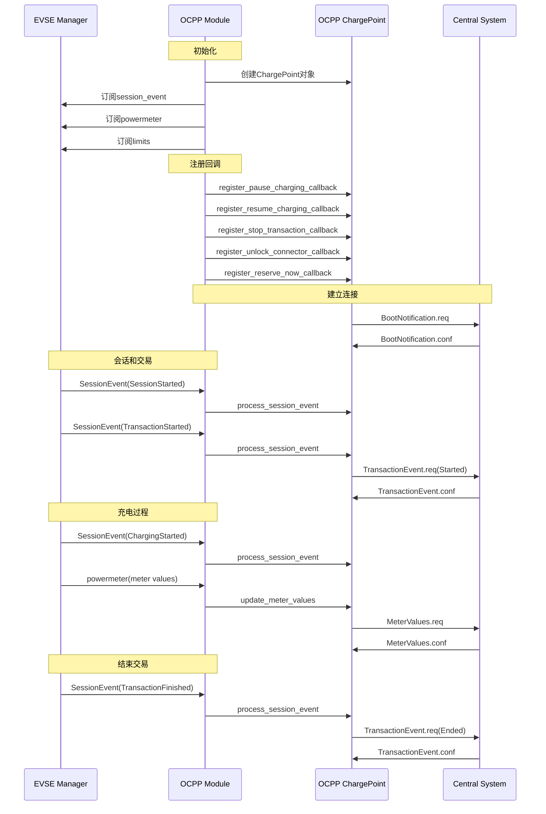
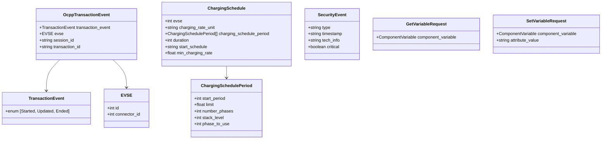
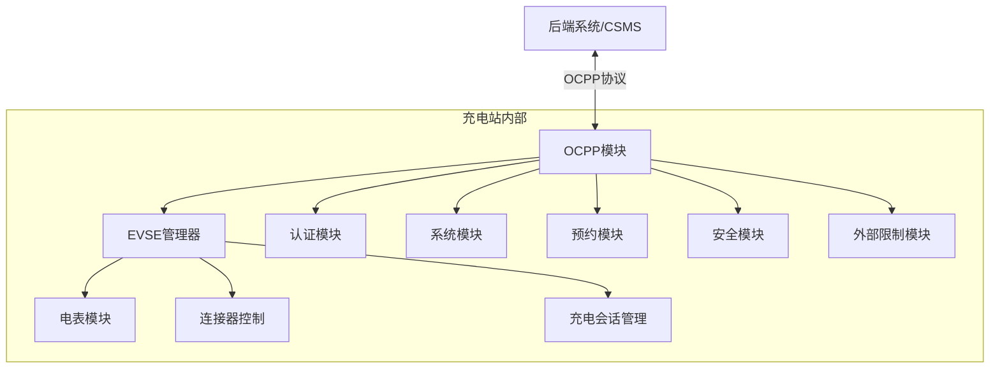

# OCPP模块抽象结构分析

OCPP (Open Charge Point Protocol) 是电动汽车充电站与中央系统（后端）之间的通讯协议。在Everest Core项目中，OCPP模块负责实现这一协议，管理充电站与后端服务的通信。

## OCPP模块组成部分图

```mermaid
classDiagram
    class OCPP {
        +ocpp::v16::ChargePoint charge_point
        +init()
        +ready()
        +get_ocpp_connector_id()
        +process_session_event()
        +set_external_limits()
        +publish_charging_schedules()
    }
    
    class Interface_ocpp {
        +stop()
        +restart()
        +security_event()
        +get_variables()
        +set_variables()
        +change_availability()
        +monitor_variables()
    }
    
    class interface_ocpp_data_transfer {
        +data_transfer()
    }
    
    class interface_auth_token_validator {
        +validate_token()
    }
    
    class interface_auth_token_provider {
        +provide_token()
    }
    
    class interface_session_cost {
        +notify_session_cost()
    }
    
    class interface_ocpp_1_6_charge_point {
        +configure_cbid()
        +configure_authorization_key()
        +configure_websocket_central_system_url()
    }
    
    OCPP --|> Interface_ocpp : implements
    OCPP --|> interface_ocpp_data_transfer : implements
    OCPP --|> interface_auth_token_validator : implements
    OCPP --|> interface_auth_token_provider : implements
    OCPP --|> interface_session_cost : implements
    OCPP --|> interface_ocpp_1_6_charge_point : implements
    
    class evse_manager_interface {
        +enable_disable()
        +authorize_response()
        +reserve()
        +set_faulted()
        +pause_charging()
        +resume_charging()
        +stop_transaction()
    }
    
    class auth_interface {
        +authorize()
        +set_connection_timeout()
    }
    
    class reservation_interface {
        +reserve()
        +cancel_reservation()
    }
    
    class system_interface {
        +reset()
        +upload_logs()
        +update_firmware()
    }
    
    OCPP --> evse_manager_interface : requires
    OCPP --> auth_interface : requires
    OCPP --> reservation_interface : requires
    OCPP --> system_interface : requires
```



## OCPP模块处理流程图



## OCPP数据类型图



# OCPP模块核心功能分析

从代码中可以看出，OCPP模块的主要功能包括：

## 会话与交易管理

```cpp
void OCPP::process_session_event(int32_t evse_id, const types::evse_manager::SessionEvent& session_event) {
    // 处理来自EVSE管理器的会话事件
}
```

## 计量值上报

```cpp
evse->subscribe_powermeter([this, evse_id](types::powermeter::Powermeter powermeter) {
    // 处理电表数据
});
```

## 充电限制管理

```cpp
void OCPP::set_external_limits(const std::map<int32_t, ocpp::v16::EnhancedChargingSchedule>& charging_schedules) {
    // 根据OCPP服务器下发的充电计划设置充电限制
}
```

## 认证管理

```cpp
this->charge_point->register_authorize_callback(
    [this](const std::string& id_token, std::vector<int32_t> referenced_connectors, bool prevalidated) {
        // 处理认证请求
    });
```

## 远程控制

```cpp
this->charge_point->register_pause_charging_callback([this](int32_t connector) {
    // 处理暂停充电请求
});

this->charge_point->register_resume_charging_callback([this](int32_t connector) {
    // 处理恢复充电请求
});
```

## 固件更新

```cpp
this->charge_point->register_update_firmware_callback([this](const ocpp::v16::UpdateFirmwareRequest msg) {
    // 处理固件更新请求
});
```

# OCPP模块与其他模块的关系

OCPP模块在整个Everest Core系统中扮演着核心角色，它是充电站与后端系统通信的桥梁。通过分析代码，我们可以看到以下关系：



# 核心代码示例分析

## 会话事件处理

OCPP模块通过订阅EVSE管理器的会话事件来处理充电过程中的各种状态变化：

```cpp
evse->subscribe_session_event([this, evse_id](types::evse_manager::SessionEvent session_event) {
    std::lock_guard<std::mutex> lock(this->session_event_mutex);
    this->event_queue[evse_id].push(session_event);
    
    if (this->started) {
        this->process_session_event(evse_id, session_event);
    }
});
```

这段代码展示了OCPP模块如何订阅EVSE管理器的会话事件，并将其存入事件队列，然后在适当的时候处理这些事件。

## 充电限制设置

OCPP模块将中央系统下发的充电计划转换为充电站内部的限制：

```cpp
void OCPP::set_external_limits(const std::map<int32_t, ocpp::v16::EnhancedChargingSchedule>& charging_schedules) {
    // 遍历所有由libocpp报告的计划，为每个连接器创建ExternalLimits
    for (auto const& [connector_id, schedule] : charging_schedules) {
        if (not external_energy_limits::is_evse_sink_configured(this->r_evse_energy_sink, connector_id)) {
            EVLOG_warning << "Can not apply external limits! No evse energy sink configured for evse_id: "
                          << connector_id;
            continue;
        }

        types::energy::ExternalLimits limits;
        std::vector<types::energy::ScheduleReqEntry> schedule_import;
        // 处理充电计划中的每个时段
        for (const auto period : schedule.chargingSchedulePeriod) {
            // 将OCPP充电计划转换为Everest内部的限制格式
            types::energy::ScheduleReqEntry schedule_req_entry;
            types::energy::LimitsReq limits_req;
            // 设置时间戳
            const auto timestamp = start_time.to_time_point() + std::chrono::seconds(period.startPeriod);
            schedule_req_entry.timestamp = ocpp::DateTime(timestamp).to_rfc3339();
            // 设置相位数量
            if (period.numberPhases.has_value()) {
                limits_req.ac_max_phase_count = period.numberPhases.value();
            }
            // 设置电流或功率限制
            if (schedule.chargingRateUnit == ocpp::v16::ChargingRateUnit::A) {
                limits_req.ac_max_current_A = period.limit;
                if (schedule.minChargingRate.has_value()) {
                    limits_req.ac_min_current_A = schedule.minChargingRate.value();
                }
            } else {
                limits_req.total_power_W = period.limit;
            }
            schedule_req_entry.limits_to_leaves = limits_req;
            schedule_import.push_back(schedule_req_entry);
        }
        limits.schedule_import.emplace(schedule_import);
        // 调用外部限制模块设置限制
        auto& evse_sink = external_energy_limits::get_evse_sink_by_evse_id(this->r_evse_energy_sink, connector_id);
        evse_sink.call_set_external_limits(limits);
    }
}
```

这段代码展示了OCPP模块如何将从中央系统接收到的充电计划转换为内部限制格式，并通过外部限制模块应用到充电过程中。

# 总结

Everest Core项目中的OCPP模块是一个复杂且功能丰富的组件，它通过实现OCPP协议，使充电站能够与中央管理系统通信。该模块具有以下核心特性：

1. **模块化设计**：提供和依赖多个接口，与其他模块松耦合
2. **事件驱动架构**：基于事件处理充电过程中的各种状态变化
3. **协议转换**：将OCPP协议的消息和数据结构转换为系统内部格式
4. **充电控制**：实现远程启停充电、调整充电参数等功能
5. **安全认证**：支持用户认证和OCPP安全扩展

通过OCPP模块，Everest Core系统能够与不同的后端管理系统进行标准化通信，实现充电站的远程监控、管理和控制。
