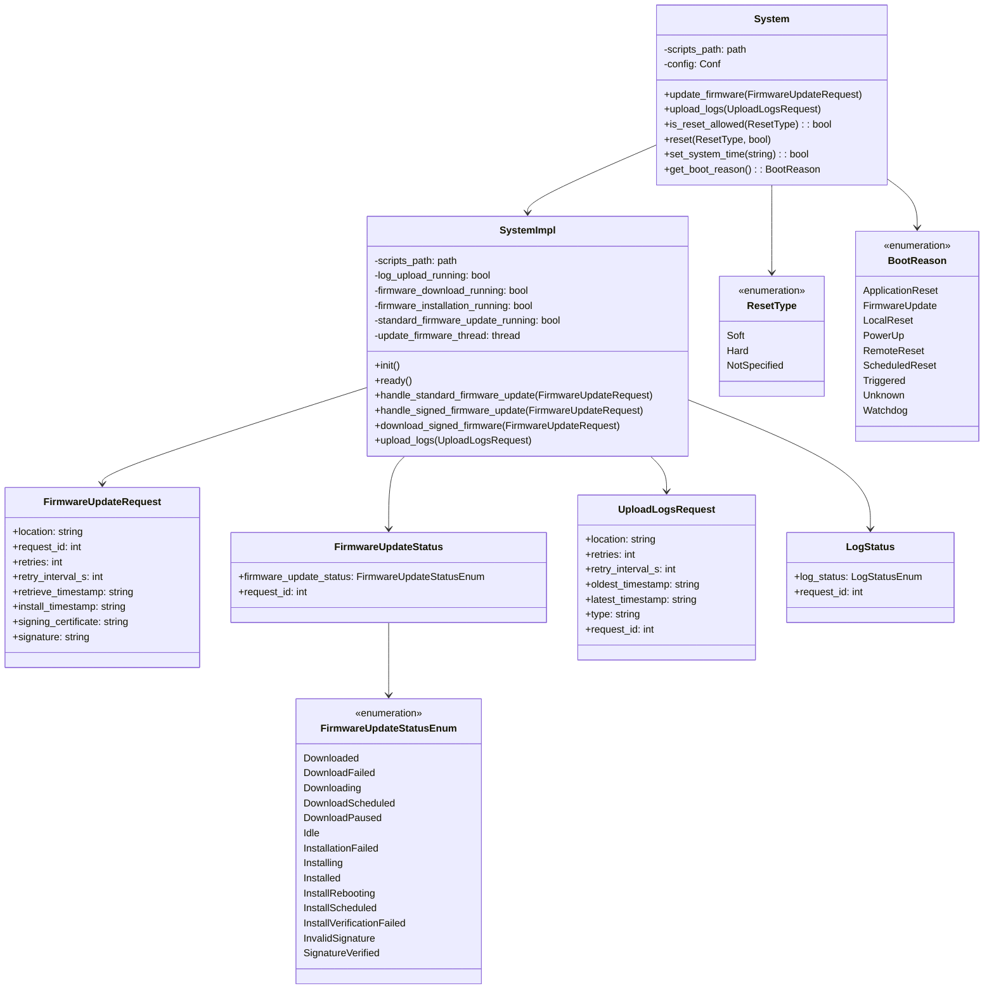
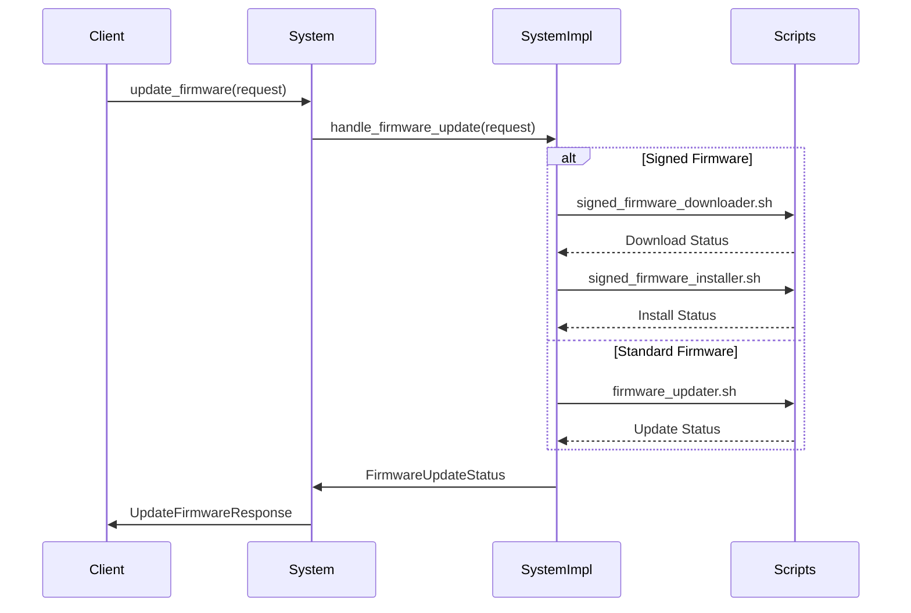
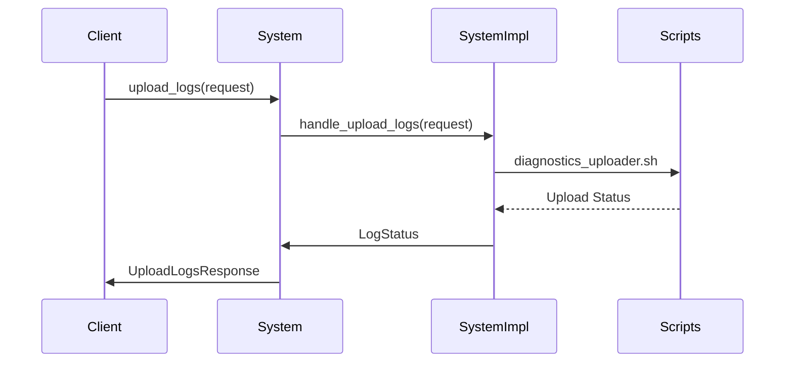
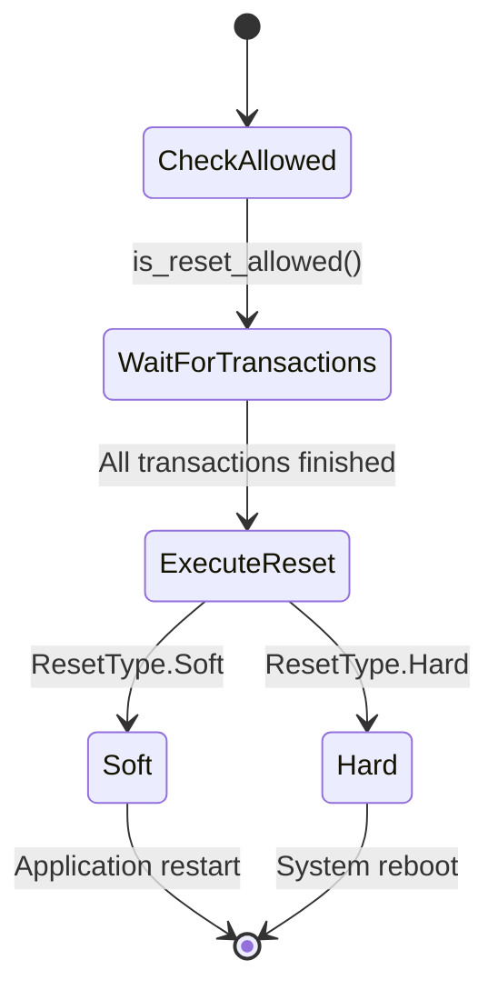
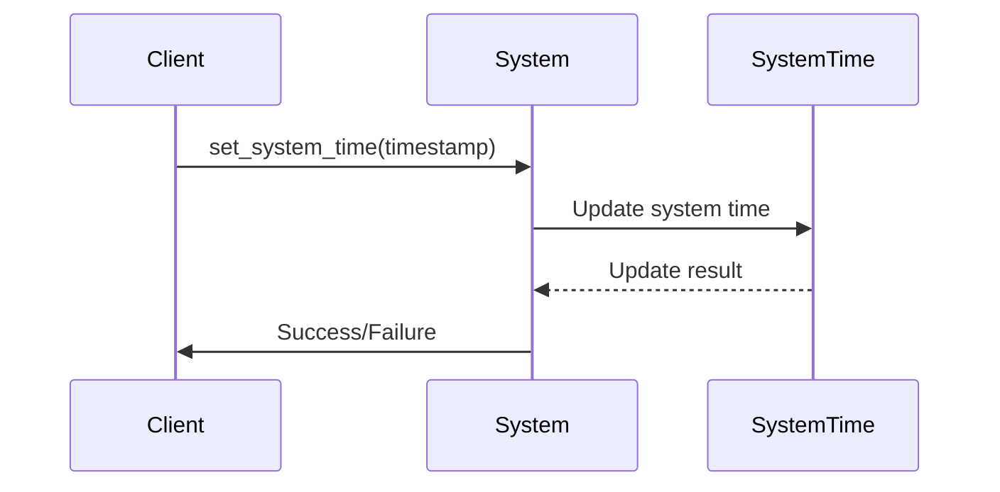
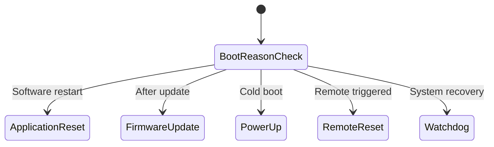

# System模块的架构和功能



# System模块功能分析

System模块是Everest Core项目中负责系统级操作的核心模块，主要提供以下功能：

## 固件更新管理



固件更新功能支持：

- 标准固件更新
- 签名固件更新（带证书验证）
- 支持重试机制
- 支持定时下载和安装
- 状态监控和报告

## 日志管理



日志管理功能包括：

- 日志上传
- 时间范围筛选
- 支持多种日志类型
- 上传状态监控

## 系统重置



系统重置功能：

- 软重置（应用重启）
- 硬重置（系统重启）
- 支持延迟执行
- 安全检查机制

## 系统时间管理



时间管理功能：

- 系统时间设置
- RFC3339格式支持
- 时间同步验证

## 启动原因追踪



启动原因追踪功能：

- 记录系统启动原因
- 支持多种启动场景识别
- 用于系统诊断和监控

## 关键代码分析

### 固件更新处理

```cpp
types::system::UpdateFirmwareResponse
systemImpl::handle_signed_fimware_update(const types::system::FirmwareUpdateRequest& firmware_update_request) {
    // 验证证书和签名
    if (!firmware_update_request.signing_certificate.has_value() || 
        !firmware_update_request.signature.has_value()) {
        return types::system::UpdateFirmwareResponse::Rejected;
    }

    // 处理定时下载
    if (firmware_update_request.retrieve_timestamp.has_value()) {
        schedule_download(firmware_update_request);
    } else {
        start_immediate_download(firmware_update_request);
    }

    // 返回更新状态
    if (this->firmware_download_running) {
        return UpdateFirmwareResponse::AcceptedCanceled;
    } else if (this->firmware_installation_running) {
        return UpdateFirmwareResponse::Rejected;
    } else {
        return UpdateFirmwareResponse::Accepted;
    }
}
```

### 配置管理

```yaml
config:
  DefaultRetries:
    description: 文件上传/下载失败重试次数
    type: number
    default: 1
  DefaultRetryInterval:
    description: 重试间隔时间（秒）
    type: number
    default: 1
  ResetDelay:
    description: 重置延迟时间（秒）
    type: integer
    minimum: 0
    default: 0
```

### 状态管理

```cpp
struct SystemState {
    bool log_upload_running;
    bool firmware_download_running;
    bool firmware_installation_running;
    bool standard_firmware_update_running;
    std::atomic<bool> interrupt_firmware_download;
    std::mutex firmware_update_mutex;
    std::condition_variable firmware_update_cv;
};
```

## 模块特点

### 可扩展性

- 模块化设计
- 清晰的接口定义
- 支持自定义脚本扩展

### 可靠性

- 完善的错误处理
- 重试机制
- 状态监控和报告

### 安全性

- 签名固件验证
- 证书管理
- 安全的系统操作

### 灵活性

- 可配置的参数
- 支持定时操作
- 多种操作模式

## 使用场景

### 远程维护

- [固件升级](./%E5%9B%BA%E4%BB%B6%E5%8D%87%E7%BA%A7.md)
- 日志收集
- [系统诊断](./%E8%AF%8A%E6%96%AD%E4%B8%8A%E6%8A%A5.md)

### 系统管理

- 时间同步
- 系统重置
- 状态监控

### 故障恢复

- 系统重置
- 日志分析
- 启动追踪

System模块作为[EVerest-core](../../EVerest-core.md)的系统管理核心，提供了完整的系统级操作接口，确保了充电系统的可维护性、可靠性和安全性。
