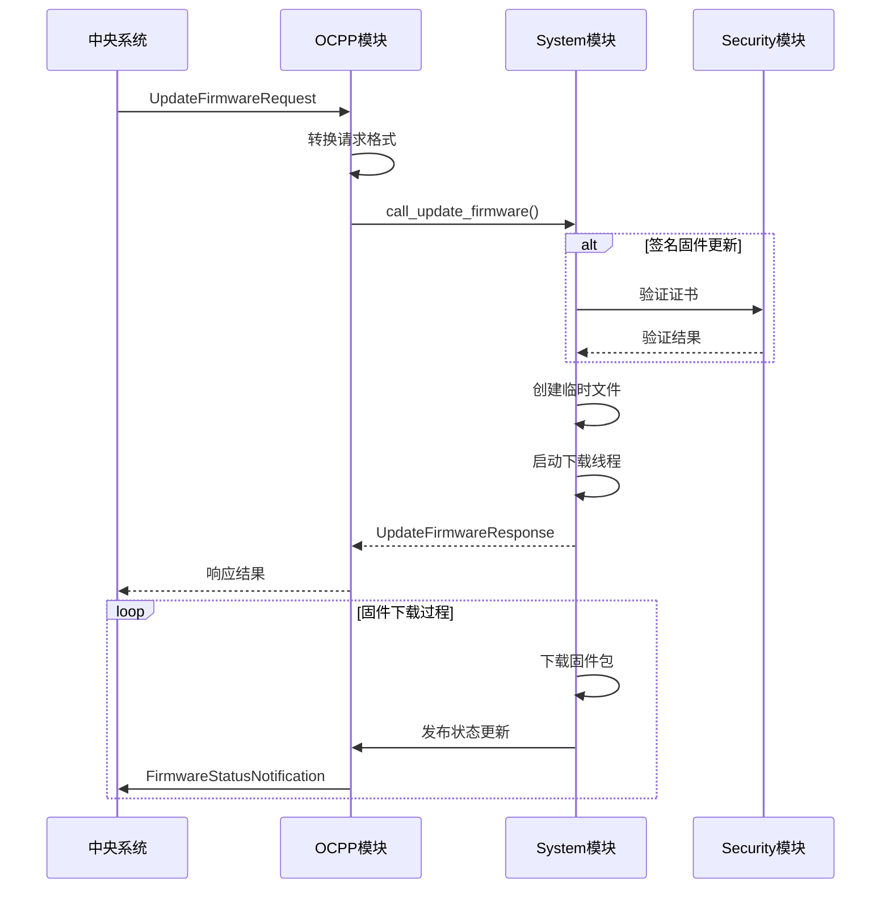
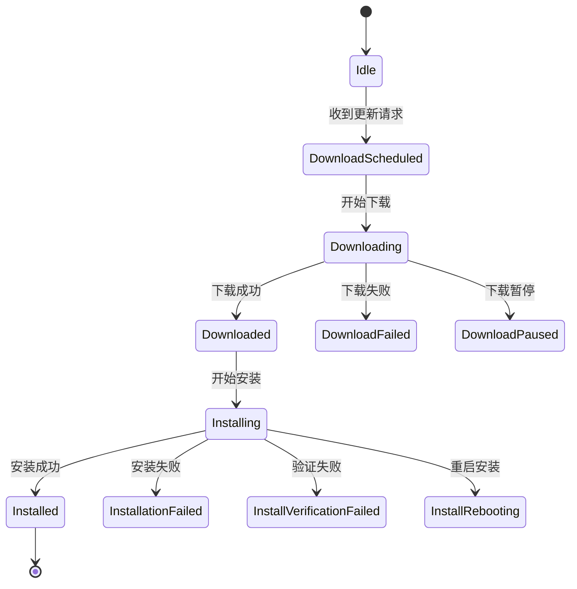

# 流程

## 固件更新的触发

- 通过OCPP协议，充电桩会收到来自中央系统的固件更新请求（UpdateFirmwareRequest）
- 请求中包含以下关键信息：
  - location: 固件包的下载地址
  - retrieveDate: 指定的下载时间
  - retries: 重试次数（可选）
  - retryInterval: 重试间隔（可选）
  - signature: 固件包签名（签名固件更新时必需）
  - signingCertificate: 签名证书（签名固件更新时必需）

## 请求处理流程



## 状态流转

固件更新过程中会经历以下状态：



## 模块交互

### ocpp模块

- 负责与中央系统通信
- 处理固件更新请求
- 转换请求格式
- 发送状态通知

```cpp
// OCPP模块中注册固件更新回调
this->charge_point->register_update_firmware_callback([this](const ocpp::v16::UpdateFirmwareRequest msg) {
    types::system::FirmwareUpdateRequest firmware_update_request;
    firmware_update_request.location = msg.location;
    firmware_update_request.request_id = -1; // 标准更新
    firmware_update_request.retrieve_timestamp.emplace(msg.retrieveDate.to_rfc3339());
    if (msg.retries.has_value()) {
        firmware_update_request.retries.emplace(msg.retries.value());
    }
    if (msg.retryInterval.has_value()) {
        firmware_update_request.retry_interval_s.emplace(msg.retryInterval.value());
    }
    this->r_system->call_update_firmware(firmware_update_request);
});

// 签名固件更新回调
this->charge_point->register_signed_update_firmware_callback([this](ocpp::v16::SignedUpdateFirmwareRequest msg) {
    types::system::FirmwareUpdateRequest firmware_update_request;
    firmware_update_request.request_id = msg.requestId;
    firmware_update_request.location = msg.firmware.location;
    firmware_update_request.signature.emplace(msg.firmware.signature.get());
    firmware_update_request.signing_certificate.emplace(msg.firmware.signingCertificate.get());
    // ...其他参数设置
    const auto system_response = this->r_system->call_update_firmware(firmware_update_request);
    return conversions::to_ocpp_update_firmware_status_enum_type(system_response);
});
```

状态通知和监控：

```cpp
// OCPP模块订阅固件更新状态
r_system->subscribe_firmware_update_status([this](const types::system::FirmwareUpdateStatus status) {
    this->charge_point->on_firmware_update_status_notification(
        status.request_id,
        conversions::to_ocpp_firmware_status_enum(status.firmware_update_status));
});
```

### [System](./index.md)模块

- 负责实际的固件下载和安装
- 管理固件更新状态
- 执行固件安装脚本
- 处理重试逻辑

System模块执行固件更新：
通过request_id是否为-1判断更新类型是否为安全更新。

```cpp
// System模块执行固件更新
types::system::UpdateFirmwareResponse
systemImpl::handle_update_firmware(types::system::FirmwareUpdateRequest& firmware_update_request) {
    if (firmware_update_request.request_id == -1) {
        return this->handle_standard_firmware_update(firmware_update_request);
    } else {
        return this->handle_signed_fimware_update(firmware_update_request);
    }
}
```

标准固件更新流程：

```cpp
//标准固件更新流程
void systemImpl::standard_firmware_update(const types::system::FirmwareUpdateRequest& firmware_update_request) {
    this->standard_firmware_update_running = true;
    
    // 创建临时文件存储固件
    const auto firmware_file_path = create_temp_file(fs::temp_directory_path(), 
                                                   "firmware-" + date_time);
    
    // 启动更新线程
    this->update_firmware_thread = std::thread([this, firmware_update_request, firmware_file_path, constants]() {
        const auto firmware_updater = this->scripts_path / FIRMWARE_UPDATER;
        
        // 重试逻辑
        int32_t retries = 0;
        const auto total_retries = firmware_update_request.retries.value_or(this->mod->config.DefaultRetries);
        
        while (firmware_status.firmware_update_status == types::system::FirmwareUpdateStatusEnum::DownloadFailed &&
               retries <= total_retries) {
            // 执行下载脚本
            boost::process::child cmd(firmware_updater.string(), 
                                    boost::process::args(args),
                                    boost::process::std_out > stream);
            
            // 更新状态并通知
            this->publish_firmware_update_status(firmware_status);
            
            if (firmware_status.firmware_update_status == types::system::FirmwareUpdateStatusEnum::DownloadFailed) {
                std::this_thread::sleep_for(std::chrono::seconds(retry_interval));
            }
        }
    });
}
```

固件安装流程：

```cpp
void systemImpl::install_signed_firmware(const types::system::FirmwareUpdateRequest& firmware_update_request,
                                       const fs::path& firmware_file_path) {
    if (!this->firmware_installation_running) {
        this->firmware_installation_running = true;
        
        // 执行安装脚本
        const auto firmware_installer = this->scripts_path / SIGNED_FIRMWARE_INSTALLER;
        boost::process::child install_cmd(firmware_installer.string(),
                                        boost::process::args(install_args),
                                        boost::process::std_out > install_stream);
        
        // 监控安装状态
        while (std::getline(install_stream, temp)) {
            firmware_status.firmware_update_status = types::system::string_to_firmware_update_status_enum(temp);
            this->publish_firmware_update_status(firmware_status);
        }
    }
}
```

### AUTH模块

- 验证固件签名
- 管理证书
- 处理OCSP请求

签名固件校验流程([具体流程](./%E6%A0%A1%E9%AA%8C%E8%AF%81%E4%B9%A6.md))：

```cpp
void systemImpl::download_signed_firmware(const types::system::FirmwareUpdateRequest& firmware_update_request) {
    // 验证签名证书
    if (!firmware_update_request.signing_certificate.has_value()) {
        EVLOG_warning << "Signing certificate is missing in FirmwareUpdateRequest";
        this->publish_firmware_update_status(
            {types::system::FirmwareUpdateStatusEnum::DownloadFailed, firmware_update_request.request_id});
        return;
    }
    
    // 处理并发下载
    if (this->firmware_download_running) {
        this->interrupt_firmware_download.exchange(true);
        std::unique_lock<std::mutex> lk(this->firmware_update_mutex);
        this->firmware_update_cv.wait(lk, [this]() { return !this->firmware_download_running; });
    }
    
    // 下载和验证过程
    while (firmware_status.firmware_update_status == types::system::FirmwareUpdateStatusEnum::DownloadFailed &&
           retries <= total_retries && !this->interrupt_firmware_download) {
        // 执行下载和验证
        boost::process::child download_cmd(firmware_downloader.string(), 
                                         boost::process::args(download_args),
                                         boost::process::std_out > download_stream);
        
        // 更新状态
        this->publish_firmware_update_status(firmware_status);
    }
    
    // 如果验证成功，初始化安装
    if (firmware_status.firmware_update_status == types::system::FirmwareUpdateStatusEnum::SignatureVerified) {
        this->initialize_firmware_installation(firmware_update_request, firmware_file_path);
    }
}
```

```cpp
// Security模块验证证书
ocpp::CertificateValidationResult verify_certificate(const std::string& certificate_chain,
                                                     const ocpp::LeafCertificateType& certificate_type);
```

## 安全机制

- 签名验证：对签名固件进行验证
- 证书管理：维护和验证证书链
- 状态监控：全程监控更新状态
- 失败处理：包含重试机制和错误恢复

## 关键配置

- DefaultRetries：默认重试次数
- DefaultRetryInterval：重试间隔
- ResetDelay：重置延迟

## 错误处理

- 下载失败：自动重试
- 验证失败：终止更新
- 安装失败：回滚或保持当前版本
- 网络问题：重试机制

## 完成流程

- 下载完成后验证
- 等待所有连接器空闲
- 执行安装
- 必要时重启设备
- 向中央系统报告最终状态

这个固件更新流程展示了EVerest项目中模块间的紧密协作，确保了固件更新过程的可靠性和安全性。整个过程是异步的，通过状态机和事件通知机制来管理，同时提供了完善的错误处理和恢复机制。
