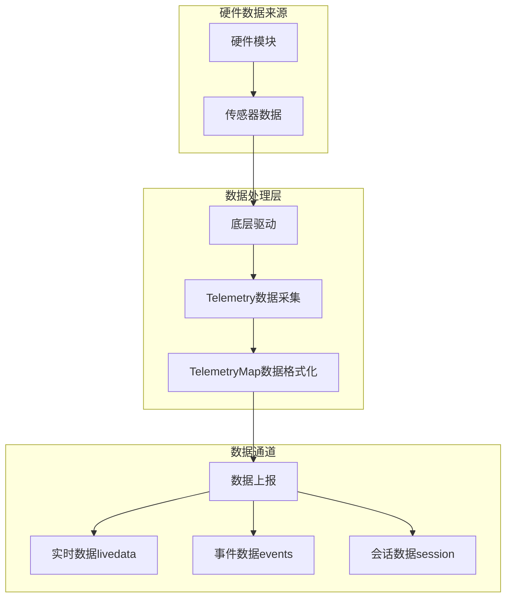
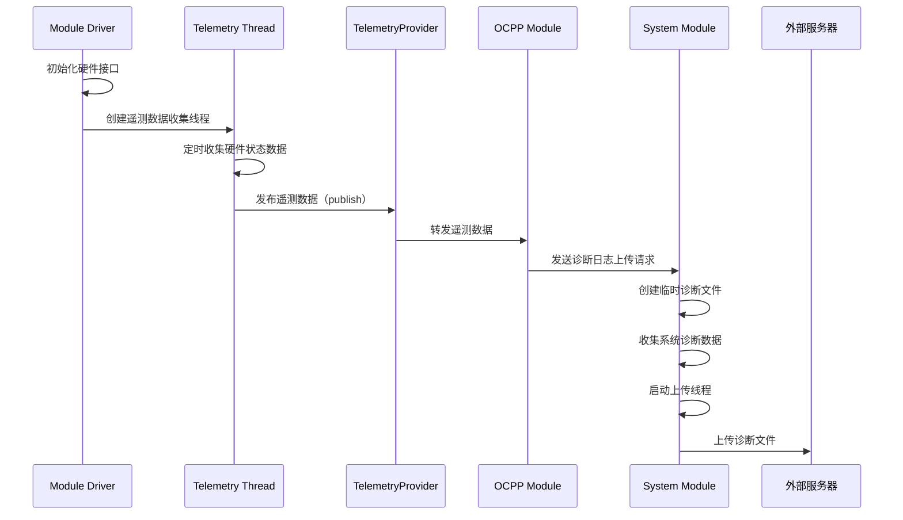
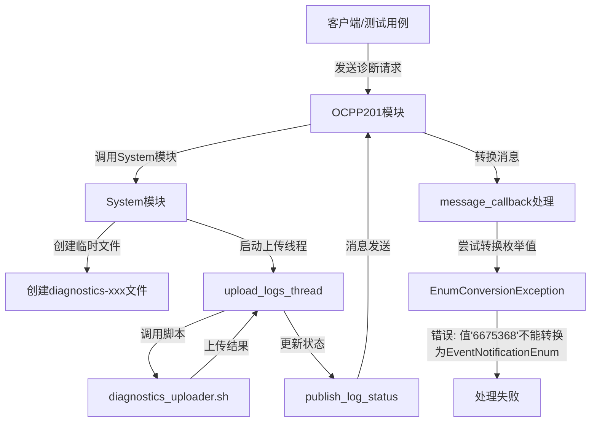
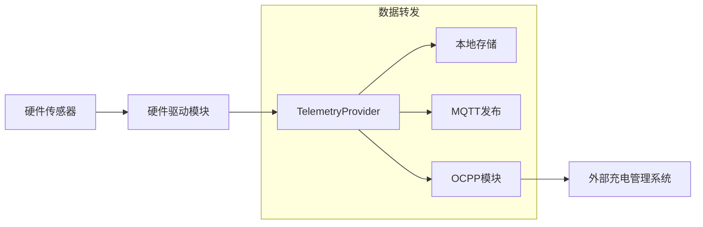

# 诊断数据的类型和来源



系统中主要收集和上报的诊断数据包括：

1. **硬件状态数据**：
   - CP (Control Pilot) 电压高低值
   - PWM占空比
   - 电源电压和电流
   - 温度数据（控制器温度、连接器温度）
   - 计量表读数

2. **事件数据**：
   - 交易开始/结束事件
   - 错误事件
   - 系统状态变化事件

3. **会话数据**：
   - 充电会话信息
   - 能量消耗数据
   - 身份认证信息

# 诊断数据采集流程



# 关键代码实现分析

## 诊断数据收集

以YetiDriver模块为例，它通过定期读取硬件状态创建遥测数据：

```cpp
// YetiDriver.cpp中的telemetryThreadHandle线程
telemetryThreadHandle = std::thread([this]() {
    while (!telemetryThreadHandle.shouldExit()) {
        sleep(10);  // 每10秒收集一次数据
        {
            std::scoped_lock lock(telemetry_mutex);
            publish_external_telemetry_livedata("power_path_controller", telemetry_power_path_controller);
            publish_external_telemetry_livedata("rcd", telemetry_rcd);
            publish_external_telemetry_livedata("power_path_controller_version",
                                                telemetry_power_path_controller_version);
        }
    }
});
```

## 数据发布机制

数据通过TelemetryProvider接口发布：

```cpp
void YetiDriver::publish_external_telemetry_livedata(const std::string& topic, const Everest::TelemetryMap& data) {
    if (info.telemetry_enabled) {
        telemetry.publish("livedata", topic, data);
    }
}
```

## 诊断数据格式

诊断数据以TelemetryMap形式存储和传输，这是一种键值对映射：

```cpp
// 电源数据示例
Everest::TelemetryMap telemetry_data{
    {"timestamp", current_iso_time_string},
    {"type", "power_path_controller"},
    {"cp_voltage_high", p_p_c.cp_voltage_high},
    {"cp_voltage_low", p_p_c.cp_voltage_low},
    {"cp_pwm_duty_cycle", p_p_c.cp_pwm_duty_cycle},
    {"cp_state", p_p_c.cp_state},
    {"temperature_controller", p_p_c.temperature_controller},
    {"temperature_car_connector", p_p_c.temperature_car_connector},
    {"watchdog_reset_count", p_p_c.watchdog_reset_count},
    {"error", p_p_c.error}
};
```

## 诊断日志上传流程

系统模块提供了诊断日志上传功能，主要步骤：



````

系统模块的上传日志实现：

```cpp
types::system::UploadLogsResponse
systemImpl::handle_upload_logs(types::system::UploadLogsRequest& upload_logs_request) {
    // 创建临时诊断文件
    const auto diagnostics_file_path = create_temp_file(fs::temp_directory_path(), "diagnostics-" + date_time);
    
    // 收集诊断数据（示例中是mock数据）
    const auto fake_diagnostics_file = json({{"diagnostics", {{"key", "value"}}}});
    std::ofstream diagnostics_file(diagnostics_file_path.c_str());
    diagnostics_file << fake_diagnostics_file.dump();

    // 启动上传线程
    this->upload_logs_thread = std::thread([this, /*参数*/]() {
        // 上传逻辑...
        const auto diagnostics_uploader = this->scripts_path / DIAGNOSTICS_UPLOADER;
        
        // 执行上传脚本
        boost::process::child cmd(diagnostics_uploader.string(), 
                                 boost::process::args(args),
                                 boost::process::std_out > stream);
        
        // 处理上传结果...
    });
}
````

## 诊断上传脚本

诊断上传通过Shell脚本实现：

```bash
#!/bin/bash
# diagnostics_uploader.sh

. "${1}"  # 加载环境变量

echo "$UPLOADING"  # 发出上传中状态
sleep 2
curl --progress-bar --ssl --connect-timeout "$CONNECTION_TIMEOUT" -T "${4}" "${2}"
curl_exit_code=$?

# 根据上传结果返回相应状态
if [ $curl_exit_code -eq 0 ]($curl_exit_code%20-eq%200.md); then
    echo "$UPLOADED"  # 上传成功
elif [ $curl_exit_code -eq 67 ]($curl_exit_code%20-eq%2067.md) || [ $curl_exit_code -eq 35 ]($curl_exit_code%20-eq%2035.md) || [ $curl_exit_code -eq 69 ]($curl_exit_code%20-eq%2069.md) ||
    [ $curl_exit_code -eq 9 ]($curl_exit_code%20-eq%209.md); then
    echo "$PERMISSION_DENIED"  # 权限拒绝
# 其他错误处理...
else
    echo "$UPLOAD_FAILURE"  # 上传失败
fi
```

# 数据流通路径



# 总结

1. **分层架构**：诊断系统采用分层架构，从硬件数据采集到最终上报形成完整链路

2. **多样数据源**：收集各种硬件状态、事件和会话数据，以键值对形式组织

3. **异步处理**：使用独立线程进行数据采集和上报，不影响主业务逻辑

4. **可靠机制**：提供重试、状态通知等可靠性机制确保诊断数据成功上报

5. **可扩展性**：系统设计支持不同类型数据的收集和上报，便于扩展更多诊断功能

诊断上报功能使充电桩能够将运行状态、错误和会话数据发送到管理系统，便于远程监控、故障诊断和维护操作。
